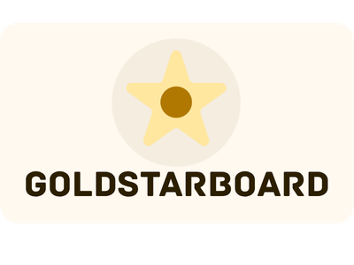

<p align="center">
  
</p>

## Description

---

This is my final project for ITAS 274 - Mobile Development II.

This is a leaderboard app for weather station.

Each station are ranked by how many days they held a gold star badge.

The gold star badge is granted to a station by providing high quality data to [weatherunderground](https://www.wunderground.com/) in which they dislay the gold star badge on the weather station page.

## Current Features

---

### Leaderboard

- Station rank by streak
- Display streak and total gold stars
- Display weather data from each hour

### Profile

- A calendar to see the gold star status of a station throughout the year

### Settings

- Swap between Metric or Imperial Measurements

### Scraper

- Run hourly to get the station's data in weatherunderground
- Run once a day at 11:50 P.M PST to assign gold star status 

## Tech Stack


| Category | Technology |
|-|-|
| Language | JavaScript & Python |
| Mobile Framework | React Native (Expo) |
| Styling | TailwindCSS & NativeWind v4 |
| Icons | Lucide React Native |
| Routing | Expo Router |
| HTTP Client | Axios |
| Package Manager (Client) | Bun |
| Linter/Formatter | oxlint & oxfmt |
| Backend Framework | Django & Django REST Framework |
| Task Scheduling | Django CronTask |
| Database | PostgreSQL |
| Containerization | Docker & Docker Compose |
| Server | Gunicorn |
| Package Manager (Server) | uv |

## Getting Started


### Prerequisites

- [bun](https://bun.sh/) 
- [uv](https://docs.astral.sh/uv/getting-started/installation/#__tabbed_1_2)
- [Expo Go v55](https://github.com/expo/expo-go-releases/releases)
- [docker](https://docs.docker.com/)

**1. Clone the repo**
```zsh
git clone https://github.com/MejarAdobo/goldstarboard.git
```

**2. Install mobile dependencies**
```zsh
cd client
bun install
```

**3. Set up virtual environment**
```zsh
cd server
uv venv
```

Linux & macOS
```zsh
source .venv/bin/activate
```

Windows
```zsh
.venv\Scripts\activate
```

**4. Install server dependencies**

Still inside the server directory
```zsh
uv sync
```

**5. Create an .env**

```
CONTAINER_NAME= # Docker container name for db
VOLUME_NAME= # Docker volume name for db
DB_ENGINE= # I use postgreSQL for my db, but other SQL db should probably work
DB_USER= # the name of the user
DB_HOST= # localhost as default
DB_PASSWORD= # the password of the db
DB_NAME= # the name of the db
DB_PORT= # default postgres port is 5432

DJANGO_SECRET_KEY= # its a secret
DJANGO_DEBUG= # Use True during development
DJANGO_ALLOWED_HOSTS= # Use * to allow everyone
DJANGO_PORT= # port the django server run on
```

**6. Run docker-compose **

Inside server directory
```zsh
docker compose up --build
```

Wait until it build the container goldstarboard_web then you can detach.

That is to ensure all the migrations happen before the next step.

**7. Create a superuser **
```zsh
docker exec -it goldstarboard_web uv run manage.py createsuperuser
```

**8. Go to django admin page**
After creating the super user

If your in localhost, go to: http://localhost:<django_port>/admin

If its deployed, go to: https://<host_name>:<django_port>/admin

**9. Create the stations**
The station field are:

- name: Could be anything
- wu_id: the weatherunderground id (ex.INANAI157)
- total_gold_star: default to 0
- total_yearly_gold_star: default to 0
- last_day_since_gold_star: a string date (ex. March 12, April 13)

After the stations are added, wait until the start of the next hour for the data to be scraped. (The interval can be edited in in tasks.py inside the scraper app)

**10. Run the client**
```zsh
cd client
bun start
```

Scan the QR code with Expo Go in your phone (This application required Expo Go 55 so only android phone works since they can install the apk from GitHub)

If your having issue scanning the QR code.

Try running:
```zsh
bun start --tunnel
```

and add ```-c``` to clear the cache
